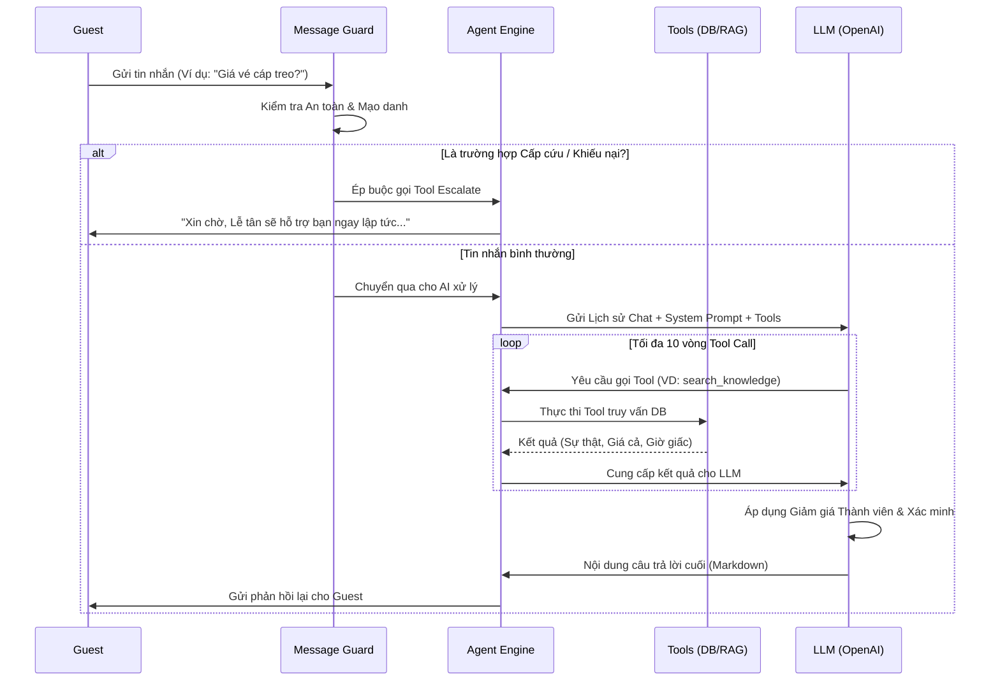
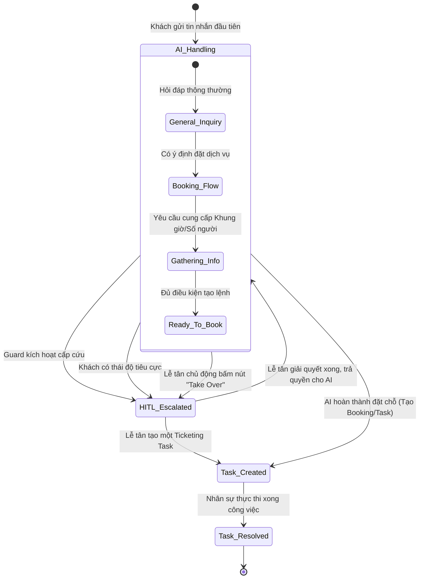

# KIẾN TRÚC HỆ THỐNG - AUREA AI CONCIERGE

Tài liệu này cung cấp cái nhìn toàn diện về cấu trúc kỹ thuật của hệ thống Aurea AI Concierge. Tất cả các sơ đồ dưới đây được render bằng **Mermaid**.

---

## 1. Sơ đồ Tổng quan Hệ thống (System Overview Diagram)

**Mô tả chi tiết:**
Sơ đồ này mô tả cách các thành phần trong hệ thống tương tác với nhau.
- **Frontend**: Khách lưu trú (Guest) có Web App riêng qua việc quét mã QR. Nhân viên khách sạn (Staff) có Dashboard quản lý theo thời gian thực.
- **Backend (Node.js/Express)**: Là bộ não trung tâm. Mọi yêu cầu HTTP/WebSocket từ Frontend đều đi qua API Server này. Backend sẽ điều phối các luồng xử lý tới AI Agent, Task Manager (quản lý công việc dọn phòng/đặt bàn), hoặc RAG Engine (truy xuất kiến thức).
- **External Services (API ngoài)**: Backend sẽ gọi OpenAI API để thực hiện nội suy (GPT-4o) và nhúng vector (Embeddings).
- **Database (SQLite)**: Tất cả dữ liệu vận hành từ danh sách khách, thông tin phòng, lịch sử chat đến vector RAG đều lưu trữ trong file `data.db`.

```mermaid
graph TD
    %% Entities
    Guest[Guest Web App<br>Giao diện Khách hàng]
    Staff[Staff Dashboard<br>Giao diện Nhân viên]
    
    %% Backend Services
    subgraph Aurea Backend (Express / Node.js)
        API[API Router<br>REST & Events]
        Agent[AI Agent Engine<br>Lõi Xử lý Ngôn ngữ]
        RAG[Hybrid RAG Engine<br>Bộ máy Tìm kiếm Vector]
        TaskManager[Operations Manager<br>Quản lý Đặt chỗ & Công việc]
    end
    
    %% External Services
    LLM[OpenAI API<br>LLM & Embeddings]
    DB[(SQLite Database<br>data.db)]
    
    %% Relationships
    Guest -->|Chat & Hành động nhanh| API
    Staff -->|Theo dõi, Can thiệp HITL| API
    
    API --> Agent
    API --> TaskManager
    
    Agent --> LLM
    Agent --> RAG
    Agent --> TaskManager
    
    RAG --> DB
    TaskManager --> DB
    API --> DB
```

---

## 2. Sơ đồ Luồng Xử lý AI Agent (Agent Flow Diagram)

**Mô tả chi tiết:**
Sơ đồ này mô phỏng vòng lặp tư duy khép kín của AI mỗi khi nhận được tin nhắn từ khách.
1. **Screening (Lọc An toàn)**: Message Guard kiểm tra xem tin nhắn có chứa từ ngữ vi phạm, rác (gibberish) hay có tính chất cấp cứu khẩn cấp (medical/security) không. Nếu có, ngay lập tức đóng luồng AI và báo động cho nhân viên.
2. **Reasoning Loop (Vòng lặp Suy luận)**: AI được ép buộc phải tuân theo nguyên tắc: *DECOMPOSE (Phân tích)* -> *GROUND (Thu thập dữ kiện)*. Ở bước này, AI gọi song song nhiều Tools (như `get_dining_facts`, `search_knowledge`). Có thể lặp lại tới 10 lần.
3. **Personalization (Cá nhân hóa)**: AI tính toán và áp dụng các chính sách ưu đãi thành viên (Loyalty: ví dụ giảm 20% thẻ Platinum).
4. **Resolve (Hoàn tất)**: AI đóng gói câu trả lời và phản hồi lại khách hàng.



---

## 3. Sơ đồ Trạng thái (State Machine Diagram)

**Mô tả chi tiết:**
Hội thoại trong hệ thống không chỉ là trò chuyện suông mà là một chuỗi hành động có trạng thái (State). 
- Một cuộc hội thoại thường bắt đầu trong trạng thái **Tự động (AI Handling)**.
- Khi khách bắt đầu muốn đặt một dịch vụ (ví dụ: đặt bàn nhà hàng), AI chuyển sang trạng thái **Thu thập thông tin (Gathering Info)** (hỏi giờ, số lượng người). 
- Một khi gặp tình huống AI thiếu thông tin, hoặc yêu cầu nhạy cảm, trạng thái chuyển sang **Can thiệp nhân công (HITL Escalated)**. Lúc này AI im lặng, nhường quyền trả lời cho nhân viên. 
- Khi mọi thứ hoàn thành, hệ thống sinh ra một **Action Task** để ghi nhận xuống cơ sở dữ liệu và vận hành.



---

## 4. Sơ đồ Triển khai (Deployment Diagram)

**Mô tả chi tiết:**
Hệ thống Aurea có kiến trúc triển khai nguyên khối (Monolith) nhằm đảm bảo dễ bảo trì và có độ trễ cực thấp.
- **Client**: Trình duyệt trên thiết bị di động (của khách) hoặc PC (của Lễ tân).
- **Web Server (NGINX)**: Hoạt động như Reverse Proxy, cung cấp SSL HTTPS và phục vụ trực tiếp các file tĩnh của UI. Đồng thời nó điều hướng (proxy_pass) các lệnh API vào tiến trình Node.js.
- **Application Server (Node.js)**: Chạy trên 1 instance duy nhất, xử lý cả UI (Vite dev) và API logic.
- **Database**: Sử dụng file `data.db` (SQLite) bật cơ chế WAL (Write-Ahead Logging) cho tốc độ cực cao, tương đương in-memory caching.

```mermaid
graph LR
    subgraph Client Environment
        Browser[Trình duyệt Khách / Lễ tân<br>(Mobile / PC)]
    end
    
    subgraph Máy chủ Triển khai (VPS / Cloud VM)
        NGINX[NGINX Reverse Proxy<br>HTTPS & Static Server]
        
        subgraph Tiến trình Node.js (PM2/Docker)
            Express[Express API Server]
            AgentLoop[AI Agent Process<br>Memory Cache]
        end
        
        SQLite[(Cơ sở dữ liệu SQLite<br>data.db + WAL Mode)]
    end
    
    subgraph Hạ tầng Đám mây Ngoại vi (Cloud Services)
        OpenAI[Hệ sinh thái OpenAI<br>GPT-4o, Embeddings API]
    end
    
    Browser -->|HTTPS / WSS| NGINX
    NGINX -->|Phân phối UI tĩnh| Browser
    NGINX -->|Proxy API Request| Express
    
    Express --- AgentLoop
    Express -->|SQL Queries| SQLite
    AgentLoop -->|SQL Queries| SQLite
    
    AgentLoop -->|HTTPS REST API| OpenAI
```
